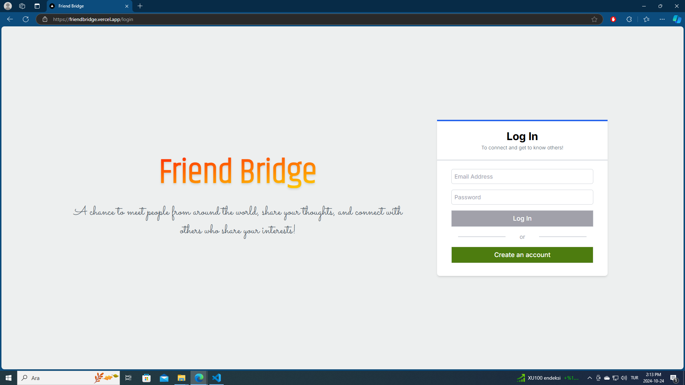
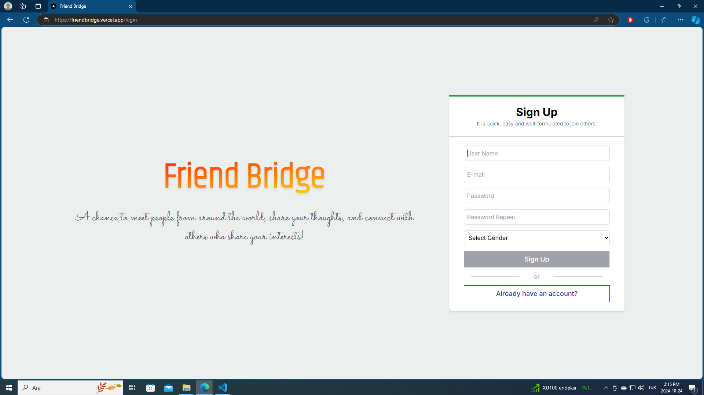
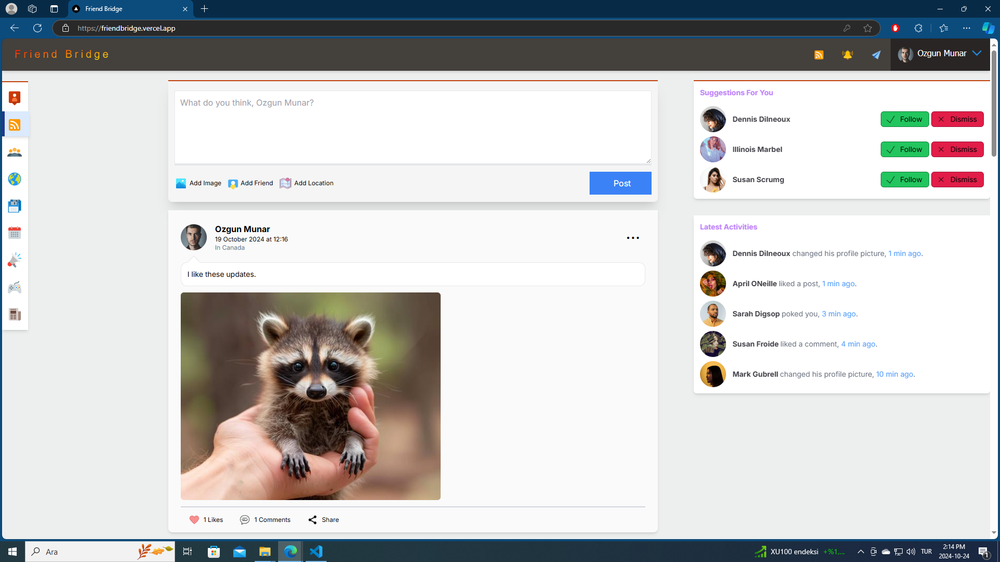
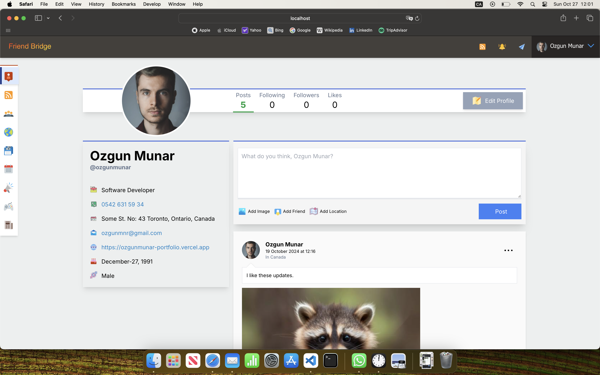

# Welcome To Friend Bridge
This fully responsible NextJS/NodeJS/MongoDB/TailwindCSS project is a social media web app that lets people all over the world who are interested in the same topics will get to know each other.

## Some Screenshots of my project

## Currently Working Parts
- Create Account (Be sure you entered your real E-Mail Address because you will have a receive an email for verification purpose)
- Login / Logout
- Create post (Can tag friends, add image through image url string & add location string)
- Edit & Delete post
- Like & Comment post
- Profile page (Provides personal information and personal post history)
- Edit profile (Opens a modal to change personal data)
- Change Password (Sends an e-mail to the user with a token that has a deadline)

## Project URL
You can view the project at [Friend Bridge](https://friendbridge.vercel.app/)

## Dummy User to See The Website
Login with dummy credential so that you can see what's inside.
- User Email: "ozgunmnr@gmail.com"
- Password:   "351Admin"

## Contact
- [ozgunmnr@gmail.com](mailto:ozgunmnr@gmail.com)
- Özgün MUNAR
